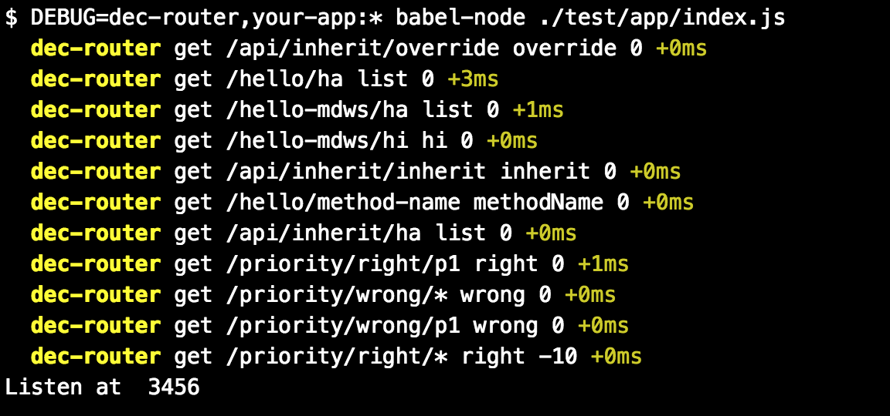

# koa-dec-router

* An ES6 decorator + class based router, support inherit, override, priority, auto load controllers, etc.
* Using [koa-router](https://github.com/alexmingoia/koa-router) under the hood.
* [Examples](test/app)


## Install

```sh
npm i -g koa-dec-router

```

or

```sh
yarn add koa-dec-router
```
## Demo

app.js
```js

import Koa from 'koa'
import DecRouter from 'koa-dec-router'

const decRouter = DecRouter({
  controllersDir: `${__dirname}/controllers`,
  before: null, // global middleware
  after: null, // global middleware
})

const app = new Koa()

// decRouter.router: `koa-router` instance
app.use(decRouter.router.routes())
app.use(decRouter.router.allowedMethods())

```

controllers/api.js
```js
import { controller, get, post } from 'dec-router'

async function apiHandler(ctx, next) {
  console.log('handle all api and subclass\'s')
  await next()
}

@controller('/api', apiHandler)
export default class Api {
  async getApiCommon(ctx) {
    // ...
    return // some common data
  }
}

```

controllers/posts.js

```js

import { controller, get, post } from 'dec-router'
import Api from './api'

async function postHandler(ctx, next) {
  console.log('handle post')
  await next()
}

// define multi controller class in one file. You can passing {expose: false} to disable exposing this controller, which can still be inherit.
@controller('/subpost')
export class Subpost {
  @get('s')
  async list(ctx) {
    ctx.body = 'get subpost'
  }

}

@controller('/post')
export default class Post extends Api {

  @get('s') // final path = parent controller path + controller path + method path
  async list(ctx) {
    const commonData = await super.getApiCommon()
    ctx.body = 'get posts'
  }

  @get('/:id', {priority: -1}) // wildcard using low priority, let `special` method handle first
  async get(ctx) {
    ctx.body = 'get' + ctx.params.id
  }

  @get('/special')
  async special(ctx) {
    ctx.body = 'special post'
  }
}

```

## Console output

To output all routes generated by dec-router, you can run your app like

```sh
DEBUG=dec-router,your-app:* node ./your-app.js
```
For windows, using [cross-env](https://github.com/kentcdodds/cross-env)

```sh
cross-env DEBUG=dec-router,your-app:* node ./your-app.js
```




[See more about `DEBUG`](https://github.com/visionmedia/debug)


## API Reference

### DecRouter(options)
* options: {object}
  * controllersDir: {string} controllers directory
  * before: {function} optional, first middleware for all controller methods
  * after: {function} optional, last middleware for all controller methods (before controller method)
  * autoLoadControllers: {bool} optional, default is true

### @controller(path, opts, ...middlewares)

> Controller decorator.

* path: {string} optional, path of this controller, default is `'/' + slug(cls.name)`, can be inherited
* opts: {object} optional, options, cannot be inherited
  * ignoreParentPath: {bool} optional, default is false
  * ignoreParentMdws: {bool} optional, default is false
  * expose: {bool} optional, expose as a route default is false
* middlewares: {Array<function>} optional, koa middlewares, can be inherited


### @route(method, path, opts, ...middlewares)
> Controller method decorator, default would totally override superclass's method with **same path** (not same name), including method, opts, middlewares, etc.
* method: {string}, one of `'get', 'head', 'post', 'put', 'delete', 'patch', 'use'`;
* path: {string} optional, path of this method, default is `'/' + slug(method.name)`
* opts: {object} optional, options
  * priority: {number} optional, larger before smaller, default is 0
  * ignoreCtrlPath: {bool} optional, ignore all controller path, including superclass's, default is false
* middlewares: {Array<function>} optional, koa middlewares


### @get(path, opts, ..middlewares)
alias of @route('get', path, opts, ...middlewares)

### @head(path, opts, ..middlewares)
alias of @route('head', path, opts, ...middlewares)

### @post(path, opts, ..middlewares)
alias of @route('post', path, opts, ...middlewares)

### @put(path, opts, ..middlewares)
alias of @route('put', path, opts, ...middlewares)

### @del(path, opts, ..middlewares)
alias of @route('delete', path, opts, ...middlewares)

### @patch(path, opts, ..middlewares)
alias of @route('patch', path, opts, ...middlewares)

### @all(path, opts, ..middlewares)
alias of @route('use', path, opts, ...middlewares)
